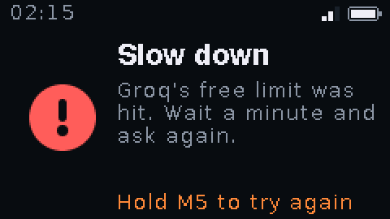

# Jarvis for M5StickC Plus2

A pocket voice assistant for the [M5StickC Plus2](https://docs.m5stack.com/en/core/M5StickC%20PLUS2).
Hold the button, ask anything out loud, and read the answer on the stick's
screen. Jarvis searches the web before it answers, so it knows about things
that happened this week, and it runs entirely on free API plans.

<p>
  
  
  
  
  
  
</p>

Jarvis has a face: a little pixel-art robot that bobs and blinks on the home
screen, perks up with wide eyes while you talk, glances around while it
searches, does a happy dance when the answer arrives, and shows X eyes when
something goes wrong.

No extra hardware: it uses the stick's own microphone, screen, buttons and
battery.

## What it does

- **Push to talk.** Hold the M5 button and speak for up to 15 seconds.
- **Searches before it answers.** Your question is transcribed, searched on
  the web, and answered from the results in a few short sentences.
- **Readable answers.** Your question sits above the answer, and long answers
  scroll with the side buttons.
- **Wi-Fi menu.** Scan for networks, pick one, and Jarvis remembers it for
  next time. It also joins any network from your saved list on its own.
- **Info screen.** Time, date, battery level and voltage, Wi-Fi network,
  signal and IP address.
- **No accidental power-offs.** Long presses show a countdown along the edge
  of the screen next to the button you're holding.
- **Battery friendly.** The screen dims after 30 seconds and switches off
  after 2 minutes; any button wakes it.

## How it works

| Step | Service | Model |
|---|---|---|
| Speech to text | [Groq](https://groq.com) | `whisper-large-v3-turbo` |
| Web search | [Tavily](https://tavily.com) | basic search, 5 results |
| Answer | Groq | `openai/gpt-oss-120b`, high reasoning effort |

A typical question takes 10 to 12 seconds from letting go of the button to
the answer. If the search fails, Jarvis answers from the model's own
knowledge and shows a "no web" tag next to the clock, since those answers can
be out of date.

## What you need

- An **M5StickC Plus2**. Other M5Stick models aren't supported: Jarvis needs
  the Plus2's 2 MB of PSRAM.
- A **USB-C cable that carries data**. Plenty of cables only charge; if your
  computer doesn't see the stick, try another cable first.
- Two **free API keys**, neither of which asks for a card:
  - Groq: [console.groq.com/keys](https://console.groq.com/keys)
  - Tavily: [app.tavily.com](https://app.tavily.com/home)
- **PlatformIO** to build and flash: `pip install platformio`

## Install

1. **Back up the factory firmware** (optional, but it lets you go back). Find
   the stick's port first: `/dev/cu.usbserial-*` on macOS, `/dev/ttyUSB*` or
   `/dev/ttyACM*` on Linux, `COM3` or similar on Windows.

   ```bash
   python3 -m esptool --chip esp32 -p PORT -b 115200 read-flash 0 0x800000 plus2-factory.bin
   ```

2. **Get the code and add your settings.**

   ```bash
   git clone https://github.com/archit-suryawanshi/jarvis-m5stick
   cd jarvis-m5stick
   cp include/secrets.example.h include/secrets.h
   ```

   In `include/secrets.h`, add your Wi-Fi networks (2.4 GHz only), both API
   keys and your time zone. `secrets.h` is in `.gitignore`, so it stays on
   your machine.

3. **Build and flash.**

   ```bash
   pio run -t upload --upload-port PORT
   ```

   Flashing runs at 230400 baud because the Plus2's USB chip (CH9102) drops
   out at higher speeds.

## Buttons

Hold the stick with the M5 button on the right. The side button is then on
top and the power button at the bottom.

| Button | Click | Hold |
|---|---|---|
| M5 | Home screen | Talk (in the Wi-Fi menu: join) |
| Top | Scroll up (Wi-Fi menu: move up) | 1 s: Wi-Fi menu (in the menu: back) |
| Bottom | Scroll down (Wi-Fi menu: move down) | 1 s: info screen. About 2.2 s: power off |

On the home screen, a tap on M5 (or a top or bottom click) reopens the last
answer.

Asked the wrong thing, or Whisper misheard you? While Jarvis is searching,
**tap M5 three times quickly** to cancel and go back home.

The bottom button is the Plus2's power button, and its hardware cuts the power
when it's held for about 2.5 seconds. So after the info screen opens, a red
countdown shows how long is left, and Jarvis shuts down cleanly just before
the hardware would. Let go any time before that to stay on.

## Free plan limits

Measured cost per question: one Tavily search and about 2,200 Groq tokens.

| Service | Free limit | Roughly |
|---|---|---|
| Tavily | 1,000 searches a month | 30 questions a day |
| Groq `gpt-oss-120b` | 200,000 tokens a day, 8,000 a minute | 90 questions a day, 3 a minute |
| Groq Whisper | 2,000 requests a day | more than you'll use |

If Groq's limit is reached, Jarvis shows "Slow down" with how long to wait.

### Why not Groq's built-in web search?

Groq offers a `browser_search` tool, but it loads whole web pages into the
model. In testing, one question used 30,000 tokens at low reasoning effort and
155,000 at high effort, so the free daily limit covered one or two questions.
Tavily returns short snippets instead, which brings a question down to about
2,200 tokens.

## Troubleshooting

- **The computer doesn't see the stick.** Use a data cable, plug straight into
  the computer rather than a hub, and push the USB-C plug fully home.
- **"No Wi-Fi".** The ESP32 only joins 2.4 GHz networks. Hold the top button
  to open the Wi-Fi menu and see what's in range. Networks behind a login page
  (hotels, campuses) aren't supported yet.
- **"Bad API key".** Check the key in `secrets.h` was copied in full, then
  flash again.
- **"Slow down".** You've hit Groq's per-minute or daily free limit.
- **"Lost the connection while sending your question".** The Wi-Fi link
  dropped during the upload, usually from a weak signal. Jarvis already
  retries once; move closer to the router if it keeps happening. Uploads are
  kept small (8-bit mu-law audio with the silence trimmed), but a 2.4 GHz
  signal below about -75 dBm is still unreliable.

## Restore the factory firmware

```bash
python3 -m esptool --chip esp32 -p PORT -b 115200 write-flash 0 plus2-factory.bin
```

## A note on keys

Your Wi-Fi passwords and API keys are compiled into the firmware, so anyone
who has the stick could read them out. Use keys you can revoke, and don't
lend the stick out with your keys on it.

## Ideas and contributions

Pull requests are welcome. Some directions that would be great:

- Spoken answers through a real speaker such as the M5Stack SPK2 Hat (the
  built-in buzzer was tried and isn't intelligible)
- Logging in to Wi-Fi networks that use a captive portal
- Support for more boards

For checking UI changes without photographing the screen,
`python3 tools/screenshot.py PORT home listen work answer error` saves PNGs of
each screen from a connected stick.

## License

[MIT](LICENSE). Not affiliated with M5Stack, Groq, Tavily or OpenAI.
